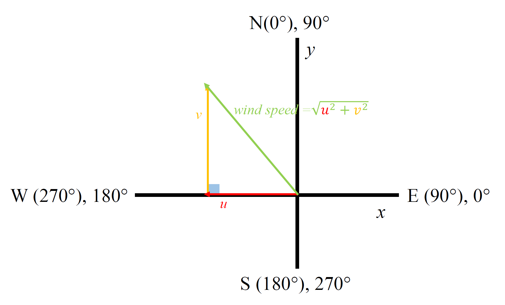
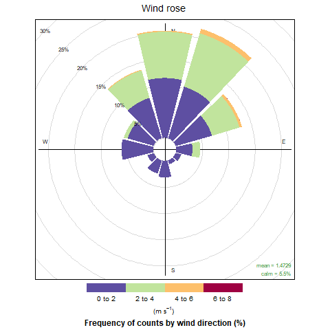

## Calculate and plot wind speed and direction from u,v in wind data 

1. Load data 

The data used here is from Sonic anemometer measurements made over a few hours in one day. The default for `read.table()` *"is to convert character variables (which are not converted to logical, numeric or complex) to factors"* hence the need to set the stringsAsFactors to false. 
 ````
library(data.table)
library(tidyr)
library(dplyr)
library(openair)
options(stringsAsFactors=F)

#Load the wind data file 
windfile<-read.table("~/GitHub/Atmo/Sonicdata.txt",skip=2,fill=TRUE,sep="")

#Use separate function from dplyr to split column 3 into additional columns. 
#Some NA values are introduced on some rows
windfile2<-separate(windfile,
                    col = "V3",
                    into = c("Q","u","v","w", "unit","X","status"),
                    sep = ",")

#Name all rows in your data frame 
names(windfile2)<-c("Date","Time","NodeAddress","u","v","w","units(m/s)","SpeedOfSound","SonicTemp")
````
2. Convert data formats
After this I removed some NA values that were introduced when importing the data. All the data was in character format so the next step is to change it to numeric before doing the calculation. The `sapply()` function makes it possible to do this over all the columns that need it 

````
#Convert U,V,and W axis columns from character to numeric 
windfile2_complete[,4:6] <- sapply(windfile2_complete[,4:6],as.numeric)
````

3. Create functions to calculate wind speed and direction
The figure below shows how the wind vector is related to the components U and V



The wind components are eastward and northward wind vectors that are represented by the variables “U” and “V” respectively.The U wind component is parallel to the x-axis (i.e. longitude). A positive U wind comes from the west, and a negative U wind comes from the east. The V wind component is parallel to the y- axis (i.e. latitude). A positive V wind comes from the south, and a negative V wind comes from the north. The wind direction can be calculated using trigonometric functions: Angle = arctan(V/U), this is valid as long as U is not equal to zero. You must also adjust for what quadrant you are in based on whether U and V are positive or negative. The built-in arctan2() function in R and some other programming languages will handle this. However, one still has to know whether they are working in radians or degrees when evaluating the results. The trigonometric functions in R return angles in radians.<sup>1</sup>

````
#Create two functions to calculate the wind direction and wind speed from u,v 
# axis. Sonic anemometer gives wind speed outputs as +ve or -ve speeds along the
# U axis, V axis and W(vertical) axis 

windDir <-function(u,v){
  (270-atan2(u,v)*180/pi)%%360 
}

#WDIR= (270-atan2(V,U)*180/pi)%360

windSpd <-function(u,v){
  sqrt(u^2+v^2)
}


#Compute wind direction and wind speed using the functions just created
#The openair package needs to have wind direction stored as "wd" and wind speed
#stored as "ws" to pick those columns and plot the wind rose
windfile2_complete$wd <-windDir(windfile2_complete$u,windfile2_complete$v)
windfile2_complete$ws <-windSpd(windfile2_complete$u,windfile2_complete$v)

````
*NB:the %% in the `windDir` function above is the modulus operator, written `% ` or `mod` in most programming languages. In the calculation it ensures that the output is between 0 and 360 degrees.*

4. Plot the wind rose 

With the wind speed and direction calculated, the windrose is plotted using the windRose function from the 




<a name="Ref">1</a>:

Further reading: 
* 
* 
